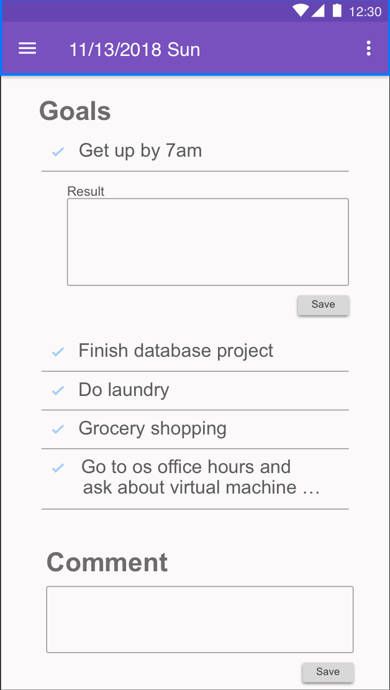

# About Motinal

### Overview
Motinal (Motivation Journal) is an Android application that allows users to log their personal daily goals and results. The main purpose of this app is to organize daily tasks and to get motivated by the accomplishment. By stating items that users want to accomplish for each day, it helps them to organize what needs to be done. By logging the actual results for each planned item, users can feel accomplished and get motivated.

 

### Features of the first release
- Users can add daily goals
- Users can edit goals when they click the item
- Users can add results for each planned items
- Users can add additional items that they accomplished on the day
- Users can add comments for the day
- Users can delete goals by long pressing items
- Users can view the 5 most recent logs that they made

### Possible features for later release
- Users are able to share reports to someone
- Sign up/ Log in

## Specifications

### Main Screen
This screen is the main screen that users will be interacting. There are Goals section and Comment section. The Goals section consists of lists that users can add daily goals (initially one row in the list with the empty item and users can start writing on the list).

Once users finish creating the list item, the next click to the item will result in showing the results area just under the item. Users can put some comments for inside the area and can save the comment.

Once users save results by clicking "Complete Logging" button, the item is marked as completed (the color of icon will become dark blue and the item is crossed out). Before users save results, they can add more goals during the day.

After users save results, the list will be reset for logging for the next day. The date on the top bar will be updated.

For the first release, users can log only for the current day or the next day.

### Side Menu
Users can view the side menu by clicking the menu icon on the top left corner. On the side menu, it shows the most recent entries that users created as a record. When there are more than 5 entries, the old ones are deleted from the database. A new entry gets stored in the database once users save a log on the main screen. When users click each record on the side menu, it shows a record screen with a non-editable record for the date that users saved the log.
